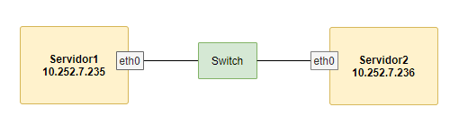
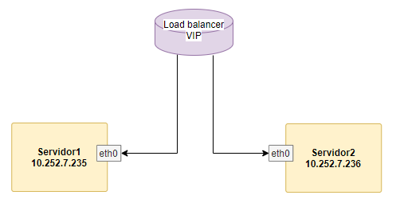
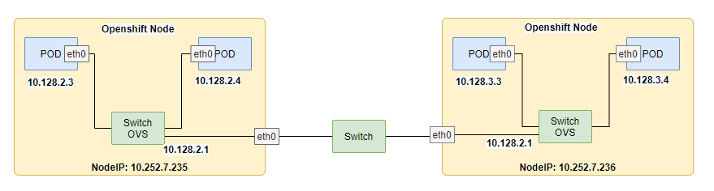
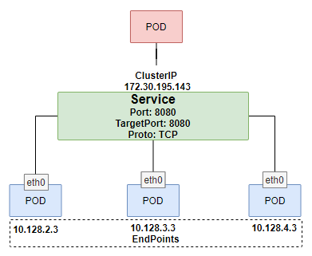
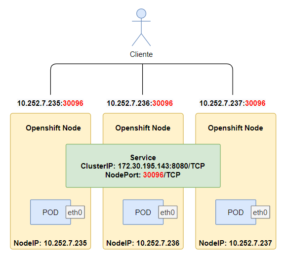

# Openshift Networking Services

## Tabla de Contenido

*Kubernetes Service Deep Dive*
* Introducción
* ¿Cómo conectamos pod en Openshift?
* Kubernetes Services
* Documentación
* Services Type
  * ClusterIP
    * Endpoints
    * IPTables
  * NodePort
  * ExternalNamne
  * LoadBalancer
* Conclusiones

## Introducción

Cuando comenzamos a nadar por el mundo de los contenedores de la mano de Openshift o de Kubernetes, inmediatamente comenzamos a disfrutar de los beneficios de buildear, desplegar y exponer las bellas aplicaciones. Lanzamos, ubicamos y eliminamos pods por todos los rincones del cluster. Todos trabajamos felices hasta que las cosas por algun motivo comienzan a comportarse de manera inadecuada y tenemos que verificar que es lo que sucede.

En lo que respecta a redes dentro de Openshift o Kubernetes, tenemos muchas aristas por revisar. Estas aristas son las tradicionales de cualquier centro de datos, pero definido por software y dentro de los nodos que componente nuestros clusters.

En este post vamos a trabajar desglozando todo lo que sucede a la hora de conectar dos aplicaciones dentro de Openshift como así también que sucede cuando un cliente externo se conecta a un servicio dentro de Openshift. 

Los escenarios son los siguientes.

* Conexión Interna entre aplicaciones dentro de Openshfit.
* Conexión Externa a una aplicación dentro de Openshift.

## ¿Cómo conectamos pod en Openshift?

En el mundo tangible de un centro de datos tenemos grandes redes donde participan diferentes componentes de red. Tradicionalmente tenemos un servidores, cada servidor con una interfaz de red. Un cable para conectar el servidor con un dispositivo central, el switch. Este dispositivo nos permite concentra una gran cantidad de servidor o dispositivos de red para que entre ellos puedan dialogar. 




Si nosotros quisieramos tener multiples réplicas de una aplicación, tendríamos que levantar múltiples aplicaciones ofreciendo el mismo servicio y a su vez para poder tener un único punto de acceso común deberiamos agregar un balanceador de carga (load balancer) que nos permita por una misma dirección ip (virtual ip) poder acceder a múltiples replicas de una aplicación. Un load balancer nos permite extendernos en las cantidad de réplicas manteniendo un único punto de acceso la VIP.




Ahora bien, en el mundo de los contenedores es exactamente igual, en vez de servidores tenemos `Pods` con una intefaz virtual y se conectan a los puertos de un `switch virtual`. Como verán, es lo mismo que en el ambiente físico.



Ahora bien, las ventajas de utilizar un cluster de Openshift es poder tener múltiples réplicas de nuestras aplicaciones. Esto es multiples pods cumpliendo una misma función y como en el ambiente tradicional necesitamos algun mecanismo que nos permita un balanceo de carga y nos brinde un único punto de acceso. Esto en Kubernetes y Openshift se resuelven con un recurso llamado `services`.


Si un pod de otro servicio quisiera consumir el servicio ofrecido por la `app-a` no llamaría a la ip de los pods sino que llamaría a la ip del servicio `svc-app-a`. Queda representado en el gráfico.



## Kubernetes Services

Dentro de openshift un servicio identifica un único punto de acceso a múltiples pods y es definido por medio del recurso llamado `service` en la API de Kuberntes y que hereda Openshift. Pero bien, como se implementan técnicamente?.

Como hemos visto anteriormente un servicio (service) asemeja el funcionamiento de un load balancer externo pero en el caso de Kubernetes NO es implementado por medio de un dispositivo. En este caso los servicios estan definidos por multiples reglas de iptables distibuidas en todos los nodos del cluster de kubernetes u openshift y varían según el tipo de servicio. Esto quiere decir que no es un único agente quien implementa la funcionalidad, sino que es una difinición replicada en todos los nodos.

Veamos como se define un servicio, que tipos existen y como se implementan estas series de reglas.

## Documentación

Para ver el detalle completo del funcionamiento del recurso `service` dentro de kubernetes pueden seguir este [link](https://kubernetes.io/docs/concepts/services-networking/service/) que tiene el detalle oficial del recurso. Tambien es posible y muy útil consultar la documentación por medio de la línea de comandos de cada uno de los argumentos que acepta el recurso. Para esto podemos revisarlo de la siguente manera.

```s
$ oc explain service
KIND:     Service
VERSION:  v1

DESCRIPTION:
     Service is a named abstraction of software service (for example, mysql)
     consisting of local port (for example 3306) that the proxy listens on, and
     the selector that determines which pods will answer requests sent through
     the proxy.
...
```

Donde obtenemos la primer linea de argumentos que definen el recurso, si quisieramos indigar en las sub opciones de cada opcion, solo tenemos que concatenar las opciones por ejemplo `oc explain service.spec.type`. 

## Services Type

El tipo de servicio define cómo los servicios se exponen y se consumen. Los tipos son:

* `ClusterIP`: Valor por defecto. Aloca una ip de un rango interno del cluster, rango no ruteado y no alcanzable desde el exterior. La ip de `ClusterIP` es el único punto de acceso para balancear entre los distintos `pods` agrupados por un `selector` en un recurso `EndPoints`.
* `ExternalName`: Sirve para mapear un servicio con un nombre de host externo.
* `NodePort`: Construido sobre ClusterIP y aloca un puerto en todos los nodos del cluster para poder rutear el puerto al ClusterIP.
* `LoadBalancer`: Construido sobre NodePort, al definir un servicio crea un load balancer externo en un servicio de nube. Habla con la API de AWS, Azure, GCP.

Vemos como son definidos los servicios.

## ClusterIP

Openshift nos permite crear servicios de multiples maneras sea de la manera mas tradicional definiendo manifiestos de cada uno de los recursos, utiliznado la herramienta `oc new-app` para lanzar un [`template`](https://docs.openshift.com/container-platform/4.5/openshift_images/using-templates.html) o construir una aplicación desde el código fuente. En este caso vamos a utilizar `oc new-app` para poder desplegar un templates y crear multiples recursos y entre ellos el recurso `services`.

Creamos un proyecto de trabajo y lanzamos una aplicación desde un template que creará una base postresql y una frontend en django construido por medio del proceso s2i (Source to Images) de Openshift.

```s
oc new-project test-services
oc new-app django-psql-example
....
--> Creating resources ...
    secret "django-psql-example" created
    service "django-psql-example" created
    route.route.openshift.io "django-psql-example" created
    imagestream.image.openshift.io "django-psql-example" created
    buildconfig.build.openshift.io "django-psql-example" created
    deploymentconfig.apps.openshift.io "django-psql-example" created
    service "postgresql" created
    deploymentconfig.apps.openshift.io "postgresql" created
```

En el output de la instrucción encontraremos el detalle de todos los recurso creados y con ellos el recurso services, si inspeccionamos la salida veremos dos servicios el del front `django-psql-example` y el de la base `postgresql`.

```s
$ oc get services
NAME                  TYPE        CLUSTER-IP      EXTERNAL-IP   PORT(S)    AGE
django-psql-example   ClusterIP   172.30.85.132   <none>        8080/TCP   2m36s
postgresql            ClusterIP   172.30.194.95   <none>        5432/TCP   2m36s
```

Ahora bien, en esta salida encontramos el detalle de tipo de servicio `ClusterIP`, la ip que representa el único punto de acceso y el puerto que esta ip escuchará. Veamos la definición del servicio `django-psql-example` en formato yaml.

```yaml
$ oc get service django-psql-example -o yaml
apiVersion: v1
kind: Service
metadata:
  annotations:
    description: Exposes and load balances the application pods
    openshift.io/generated-by: OpenShiftNewApp
    service.alpha.openshift.io/dependencies: '[{"name": "postgresql", "kind": "Service"}]'
  creationTimestamp: "2020-09-05T22:42:16Z"
  labels:
    app: django-psql-example
    template: django-psql-example
  name: django-psql-example
  namespace: test-services
  resourceVersion: "777808"
  selfLink: /api/v1/namespaces/test-services/services/django-psql-example
  uid: 33caecf7-705a-4ae7-992a-b102fb7fa69c
spec:
  clusterIP: 172.30.85.132
  ports:
  - name: web
    port: 8080
    protocol: TCP
    targetPort: 8080
  selector:
    name: django-psql-example
  sessionAffinity: None
  type: ClusterIP
status:
  loadBalancer: {}
```

En la definición vamos a encontrar varias cosas interesantes:

* CluterIP: ip única para todo el set de pods `127.30.85.123`. 
* Ports: Los puertos tanto para el puerto propio del servicio `port: 8080` y el port que escucharán los pods `targetPort: 8080` ambos `TCP`. 
* Selector: El `label` por el cual seleccionaremos los pods entre todos los pods del namespaces `name: django-psql-example`.
* type: ClusterIP
* sessionAffinity: Si vamos a tener algun tipo de afinidad con los pods que respondan nuestras peticiones.

Pero ahora bien, donde estan las direcciones de nuestros pods?. Esto se define en el recurso `EndPoints`.

```s
$ oc get endpoints
NAME                  ENDPOINTS          AGE
django-psql-example   10.254.5.61:8080   53m
postgresql            10.254.5.59:5432   53m
```

Como verán tenemos una ip de pods por cada endpoints. Veamos en detalle el `endpoints`.

```yaml
$ oc get endpoints django-psql-example -o yaml 
apiVersion: v1
kind: Endpoints
metadata:
  annotations:
    endpoints.kubernetes.io/last-change-trigger-time: "2020-09-05T22:44:04Z"
  creationTimestamp: "2020-09-05T22:42:16Z"
  labels:
    app: django-psql-example
    template: django-psql-example
  name: django-psql-example
  namespace: test-services
  resourceVersion: "778454"
  selfLink: /api/v1/namespaces/test-services/endpoints/django-psql-example
  uid: 0c9c8941-572d-443f-9893-c7d014d5ac3a
subsets:
- addresses:
  - ip: 10.254.5.61
    nodeName: worker2.ocp4.labs.semperti.local
    targetRef:
      kind: Pod
      name: django-psql-example-1-hhng7
      namespace: test-services
      resourceVersion: "778452"
      uid: e30da900-20a2-4929-b6c7-689995e470d2
  ports:
  - name: web
    port: 8080
    protocol: TCP
```

Interesante, vemos la ip y nombre del pod, el nodo donde esta corriendo y los puertos que escuchan el pod. Listemos el pod por medio del selector definido en el recurso service. 

```s
$ oc get pods -o wide -l name=django-psql-example
NAME                          READY   STATUS    RESTARTS   AGE     IP            NODE                               NOMINATED NODE   READINESS GATES
django-psql-example-1-hhng7   1/1     Running   0          50m     10.254.5.61   worker2.ocp4.labs.semperti.local   <none>           <none>
```

Ahora bien, que pasa si aumentamos una réplica de `django-psql-example`

```s
$ oc scale dc django-psql-example --replicas=2
deploymentconfig.apps.openshift.io/django-psql-example scaled
```

Revisemos de nuevo los endpoints y encontramos la lista de los dos pods con los datos de ip, nombre, nodo, namespaces y puertos.

```yaml
$ oc get endpoints django-psql-example -o yaml
apiVersion: v1
kind: Endpoints
metadata:
  annotations:
    endpoints.kubernetes.io/last-change-trigger-time: "2020-09-05T23:40:40Z"
  creationTimestamp: "2020-09-05T22:42:16Z"
  labels:
    app: django-psql-example
    template: django-psql-example
  name: django-psql-example
  namespace: test-services
  resourceVersion: "794095"
  selfLink: /api/v1/namespaces/test-services/endpoints/django-psql-example
  uid: 0c9c8941-572d-443f-9893-c7d014d5ac3a
subsets:
- addresses:
  - ip: 10.254.4.24
    nodeName: worker0.ocp4.labs.semperti.local
    targetRef:
      kind: Pod
      name: django-psql-example-1-grddz
      namespace: test-services
      resourceVersion: "794093"
      uid: 06ae0ac2-f239-4e82-950e-dd4eb9d28374
  - ip: 10.254.5.61
    nodeName: worker2.ocp4.labs.semperti.local
    targetRef:
      kind: Pod
      name: django-psql-example-1-hhng7
      namespace: test-services
      resourceVersion: "778452"
      uid: e30da900-20a2-4929-b6c7-689995e470d2
  ports:
  - name: web
    port: 8080
    protocol: TCP
```

Verificamos las ips de los pods filtrando por el selector utilizado en la definición del servicio.

```s
$ oc get pods -o wide -l name=django-psql-example
NAME                          READY   STATUS    RESTARTS   AGE     IP            NODE                               NOMINATED NODE   READINESS GATES
django-psql-example-1-grddz   1/1     Running   0          3m49s   10.254.4.24   worker0.ocp4.labs.semperti.local   <none>           <none>
django-psql-example-1-hhng7   1/1     Running   0          60m     10.254.5.61   worker2.ocp4.labs.semperti.local   <none>           <none>
```

### Endpoints, agregar pods.

Como es el proceso de escalado?. Cuando indicamos escalar un nuevo pod lo hacemos a través de la `API de Kubernetes` que es el único punto con el que un usuario habla con el cluster indicando el estado deseado. Una vez que la API recibe el request y lo autoriza, almacena en su base de datos clave/valor llamada `etcd`. El `scheduler` descubre el nuevo estado y es el encargado de seleccionar el nodo donde se alojará este pod y setea el nodo en la definición del `pod`. El sistema `controller` es el encargado de mantener la cantidad de réplicas del pod, en el nodo es `kubelet` (sysadmin del nodo) quien se encarga de levantar el pod indicandole al `runtime de contenedores` que lo cree, por último es `kubeproxy` (netadmin) quién se encarga de definir las reglas de networking para el pod. El servicio de controller junto con los recursos de Openshift de `ReplicationController` y el nativo de Kubernets `ReplicaSet`, son los encargado de mantener las replicas deseadas. 

Al momento de levantar un nuevo pod dos procesos son relevantes para decidir cuando van a agregarse a lista de endopoints las ips de los pods, primero luego de un intervalo de tiempo es lanzado el probe de `readiness` y si este probe es exitoso es aquí cuando es considerado el pod como Ready para poder recibir conexiones y se agrega a la lista de `endpoints`.

### IPTables, donde?

Ahora bien pero que tecnología usamos para distribuir el tráfico entre pods asociados a un servicio?, por reglas de iptables replicadas en todo los nodos cada 30seg, valor por default, puede cambiarse en la configuración del operador de networking. Estas reglas son las que conforman el balanceo interno del cluster de Openshift, donde y cuando las encontramos. 

Primero veamos quien las implementan, esto cambia del color de Kubernetes que vayamos a utilizar y se relaciona directamente con la configuración del cluster al momento de la instalación. En el caso de Openshift se define en el Operador de Networking definido como un Custom Resource Definition (CRDs) e implementado en el proyecto `openshfit-sdn` y controlado por el pod del operador en el proyecto `openshift-sdn-operator`.

El proyecto `openshift-sdn` tiene tres tipos de pods: los pods de `ovs-xxx` que son los procesos de `OpenVSwitch`, switch donde se conectan todos los pods dentro de un nodo; los pods de `sdn-controller-xxx` que son el controlador de la red definida por software de openshift (SDN, Software Defined Network) y los pods de `sdn-xxx` que son los pods en cada uno de los nodos que implementan las reglas de iptables para los servicios y los pods, este es `kubeproxy` con sonbrero rojo.

En los logs de los pods de `sdn-xxx` vamos encontrar estas entradas de manera repetida e indican que las reglas son sincronizadas, como hay un pod por cada nodo en cada nodo son replicas.

```s
$ oc logs sdn-hhshh
...
I0906 11:10:29.770925    2486 proxier.go:371] userspace proxy: processing 0 service events
I0906 11:10:29.771057    2486 proxier.go:350] userspace syncProxyRules took 50.199974ms
...
```

Ahora bien, volamos a nuestro servicio y veamos donde estan implementadas las reglas de `iptables`. Para esto accedemos al pod y ejecutamos `iptables-save | grep 'test-services/django-psql-example'`

```s
$ oc rsh sdn-hhshh
sh-4.2# iptables-save | grep 'test-services/django-psql-example'
-A KUBE-SERVICES ! -s 10.254.0.0/16 -d 172.30.85.132/32 -p tcp -m comment --comment "test-services/django-psql-example:web cluster IP" -m tcp --dport 8080 -j KUBE-MARK-MASQ
-A KUBE-SERVICES -d 172.30.85.132/32 -p tcp -m comment --comment "test-services/django-psql-example:web cluster IP" -m tcp --dport 8080 -j KUBE-SVC-GIGN3HAIPPOO23F3
sh-4.2#
```
 
Que interesante, la primer regla indica que va a ser aplicada a todo los paquetes que no (!) tenganred origen `10.254.0.0/16` y destino `172.30.85.132/32` (la ip de ClusterIP) con puerto destino `8080/TCP` aplica (-j) `KUBE-MARK-MASQ`. La segunda regla indica que todo lo que sea con destino `172.30.85.132/32`, port `8080/TCP` aplica la regla `KUBE-SVC-GIGN3HAIPPOO23F3`. Veamos ahora que indica la regla `KUBE-SVC-GIGN3HAIPPOO23F3`.

```s
sh-4.2# iptables-save | grep KUBE-SVC-GIGN3HAIPPOO23F3
:KUBE-SVC-GIGN3HAIPPOO23F3 - [0:0]
-A KUBE-SERVICES -d 172.30.85.132/32 -p tcp -m comment --comment "test-services/django-psql-example:web cluster IP" -m tcp --dport 8080 -j KUBE-SVC-GIGN3HAIPPOO23F3
-A KUBE-SVC-GIGN3HAIPPOO23F3 -m statistic --mode random --probability 0.50000000000 -j KUBE-SEP-7ANA7OTZZO5QKVWN
-A KUBE-SVC-GIGN3HAIPPOO23F3 -j KUBE-SEP-JBBKRG73QF24CZJD
```

Vemos que las segunda instrucción tiene el argumento `-m statistic --mode random --probability 0.50000000000` este argumento indica que el 50% de los paquetes serán aceptados por esta regla y serán tratados por la siguiente regla `KUBE-SEP-7ANA7OTZZO5QKVWN`, el 50% restante caerá a la regla siguente con destino `KUBE-SEP-JBBKRG73QF24CZJD`. Veamos que son estas últimas dos reglas.

```s
sh-4.2# iptables-save | grep KUBE-SEP-7ANA7OTZZO5QKVWN
:KUBE-SEP-7ANA7OTZZO5QKVWN - [0:0]
-A KUBE-SVC-GIGN3HAIPPOO23F3 -m statistic --mode random --probability 0.50000000000 -j KUBE-SEP-7ANA7OTZZO5QKVWN
-A KUBE-SEP-7ANA7OTZZO5QKVWN -s 10.254.4.24/32 -j KUBE-MARK-MASQ
-A KUBE-SEP-7ANA7OTZZO5QKVWN -p tcp -m tcp -j DNAT --to-destination 10.254.4.24:8080
sh-4.2# iptables-save | grep KUBE-SEP-JBBKRG73QF24CZJD
:KUBE-SEP-JBBKRG73QF24CZJD - [0:0]
-A KUBE-SVC-GIGN3HAIPPOO23F3 -j KUBE-SEP-JBBKRG73QF24CZJD
-A KUBE-SEP-JBBKRG73QF24CZJD -s 10.254.5.61/32 -j KUBE-MARK-MASQ
-A KUBE-SEP-JBBKRG73QF24CZJD -p tcp -m tcp -j DNAT --to-destination 10.254.5.61:8080
```

En la última regla se aplica un DNAT (Destination Network Address Translation) hacia la ip `10.254.4.24:8080` que es la ip de nuestro pod que brinda el servicio. En la segunda regla vemos que aplica a la otra ip del pod `10.254.5.61:8080`. Esto nos garantiza que por medio de una politica `--random` con probabilidad de 50% para cada ip el trafico será distribuido.

Pero que pasa si escalo la cantidad de pods como se distribuyen las probabilidades?. Escalo los pods a tres con `oc scale dc django-psql-example --replicas=3 -n test-services`

```s
$ oc rsh sdn-hhshh
sh-4.2# iptables-save | grep KUBE-SVC-GIGN3HAIPPOO23F3
:KUBE-SVC-GIGN3HAIPPOO23F3 - [0:0]
-A KUBE-SERVICES -d 172.30.85.132/32 -p tcp -m comment --comment "test-services/django-psql-example:web cluster IP" -m tcp --dport 8080 -j KUBE-SVC-GIGN3HAIPPOO23F3
-A KUBE-SVC-GIGN3HAIPPOO23F3 -m statistic --mode random --probability 0.33332999982 -j KUBE-SEP-7ANA7OTZZO5QKVWN
-A KUBE-SVC-GIGN3HAIPPOO23F3 -m statistic --mode random --probability 0.50000000000 -j KUBE-SEP-JBBKRG73QF24CZJD
-A KUBE-SVC-GIGN3HAIPPOO23F3 -j KUBE-SEP-XU6QRWQ6NFR3D34U
sh-4.2#
```

En este caso de tres réplicas, pero la probabilidad cambia y esto indica que el %33.33 de los paquetes caerán en modo `random` en la primer regla. Del %76,66 de los paquetes restantes, el %50 de esos %76.66 caerá en la segunda regla y lo que reste caera en la última regla. Para conexiones por ráfagas, como GETs a un API REST, vimos que las cantidad de conexiones se distribuyen de manera homogenea, no así en ciertos escenarios donde se puede aplicar afinidad y esto viene acompañado de caso de uso. Generalmente vimos que se distribuye el tráfico de manera homogenea entre los pods pero depende de la naturaleza de la aplicación.

## NodePort

`NodePort`, es el primer método de acceso que aprendemos al comenzar a trabajar con `Kubernetes`, se ve al momento de aprender de kubernetes, la lógica es simple, reservamos un puerto por arriba del 30.000 asignado de manera dinmica en caso de no ser especificado. Este puerto se levanta en todos los nodos del cluster y cada nodo podra rutear el puerto al pod del servicio que corresponda. Esta modalidad nos permite poder consumir le servicio que recide en el pod pero a traves de un proxy pass con la ip del nodo. Supongamos el siguiente escenario.



Un cliente como un dispositivo de red como un load balancer puede acceder al socket que corresponde a la ip de host con el puerto asignado dinamicamente, internamente el servicio redirigira el trafico al pod que haya sido selecionado. Esto es util para poder trabajar con Load Balancers y exponer nuestras aplicacion no solo via http/https, sino tambien vía socket tcp. La desventaja es que todos los nodos tendran el mismos puerto abierto para el servicio, en ambientes de Openshift no se recomienda utilizar esta tipo de servicio a no ser que sea justificado.

Probemos como lo vemos desde la consola. Utilizamos la misma aplicación, y creamos el nuevo servicio con type port `NodePort`. 

Borramos el servicio original para poder re-crearlo con el flag de `nodePort`.

```s
$ oc delete svc django-psql-example
service "django-psql-example" deleted
```

Creamos el servicio por medio de la cli de Openshift, también podemos utilizar un manifiesto definido en un archivo y realizar el `oc apply -f service-nodeport.yaml` o en su defecto con el comando `kubectl apply -f service-nodeport.yaml` haciendo definido el manifest por practicidad vamos a crearlo desde el cliente oc.

```s
$ oc expose dc django-psql-example --type=NodePort --name=django-psql-example
service/django-psql-example created
```

Verificamos  el servicio con tipo `nodePort`. Podemos ver que encontramos una ip de `ClusterIP`, un puerto en `PORT(s)` y un puerto adicional al `8080` el `31070` que representa el puerto que estara abierto en todos los nodos del cluster.

```s
$ oc get svc
NAME                  TYPE        CLUSTER-IP       EXTERNAL-IP   PORT(S)          AGE
django-psql-example   NodePort    172.30.191.202   <none>        8080:32291/TCP   109s
postgresql            ClusterIP   172.30.1.44      <none>        5432/TCP         7h36m
```

Veamos el manifiesto yaml para verificar la definición de `nodeport: 30096`.

```yaml
$ oc get svc django-psql-example -o yaml
apiVersion: v1
kind: Service
metadata:
  creationTimestamp: "2020-09-06T19:23:08Z"
  labels:
    app: django-psql-example
    template: django-psql-example
  name: django-psql-example
  namespace: test-nodeport
  resourceVersion: "1121267"
  selfLink: /api/v1/namespaces/test-nodeport/services/django-psql-example
  uid: 715909af-caa9-467b-8e5b-11e3a99624d5
spec:
  clusterIP: 172.30.191.202
  externalTrafficPolicy: Cluster
  ports:
  - nodePort: 32291
    port: 8080
    protocol: TCP
    targetPort: 8080
  selector:
    name: django-psql-example
  sessionAffinity: None
  type: NodePort
status:
  loadBalancer: {}
```

Ahora si bien entramos a los nodos worker y vemos el puerto, podremos ver que esta arriba.

```s
$ oc debug node/worker0.ocp4.labs.semperti.local --image=rhel7/rhel-tools
...
sh-4.2# chroot /host 
sh-4.4# ss -putan | grep -i listen | grep 32291 
tcp   LISTEN    0      128                        *:32291                     *:*             users:(("openshift-sdn-n",pid=2490,fd=20))
sh-4.4#
```

y si le pegamos a la ip del host vemos que la conexion es exitosa y nos responde el framework web de python, django.

```s
$ curl -kv http://10.252.7.235:32291/ | head -1 
* About to connect() to 10.252.7.235 port 32291 (#0)
*   Trying 10.252.7.235...
  % Total    % Received % Xferd  Average Speed   Time    Time     Time  Current
                                 Dload  Upload   Total   Spent    Left  Speed
  0     0    0     0    0     0      0      0 --:--:-- --:--:-- --:--:--     0* Connected to 10.252.7.235 (10.252.7.235) port 32291 (#0)
> GET / HTTP/1.1
> User-Agent: curl/7.29.0
> Host: 10.252.7.235:32291
> Accept: */*
>
< HTTP/1.1 200 OK
< Server: gunicorn/19.5.0
< Date: Sun, 06 Sep 2020 19:25:48 GMT
< Connection: close
< Content-Type: text/html; charset=utf-8
< X-Frame-Options: SAMEORIGIN
< Content-Length: 18324
<
{ [data not shown]
<!doctype html>
* Failed writing body (3802 != 5742)
100 18324  100 18324    0     0   407k      0 --:--:-- --:--:-- --:--:--  416k
* Closing connection 0
curl: (23) Failed writing body (3802 != 5742)
```

Si revisamos las reglas de iptables para el servicio encontraremos definiciones para la ip de `ClusterIP` como `KUBE-SERVICE` y en las últimas líneas las reglas `KUBE-NODEPORTS` que indican la definicion para el port externo.

```s
$ oc rsh sdn-v9k76
sh-4.2# iptables-save | grep test-nodeport/django-psql-example
-A KUBE-SERVICES ! -s 10.254.0.0/16 -d 172.30.191.202/32 -p tcp -m comment --comment "test-nodeport/django-psql-example: cluster IP" -m tcp --dport 8080 -j KUBE-MARK-MASQ
-A KUBE-SERVICES -d 172.30.191.202/32 -p tcp -m comment --comment "test-nodeport/django-psql-example: cluster IP" -m tcp --dport 8080 -j KUBE-SVC-5YXNK7KOCSOUM3AE
-A KUBE-NODEPORTS -p tcp -m comment --comment "test-nodeport/django-psql-example:" -m tcp --dport 32291 -j KUBE-MARK-MASQ
-A KUBE-NODEPORTS -p tcp -m comment --comment "test-nodeport/django-psql-example:" -m tcp --dport 32291 -j KUBE-SVC-5YXNK7KOCSOUM3AE
sh-4.2# 
```

Si vemos las reglas son exactamente las mismas que para el servicio de `ClusterIP`.

```s
sh-4.2# iptables-save | grep KUBE-SVC-5YXNK7KOCSOUM3AE
:KUBE-SVC-5YXNK7KOCSOUM3AE - [0:0]
-A KUBE-SERVICES -d 172.30.191.202/32 -p tcp -m comment --comment "test-nodeport/django-psql-example: cluster IP" -m tcp --dport 8080 -j KUBE-SVC-5YXNK7KOCSOUM3AE
-A KUBE-NODEPORTS -p tcp -m comment --comment "test-nodeport/django-psql-example:" -m tcp --dport 32291 -j KUBE-SVC-5YXNK7KOCSOUM3AE
-A KUBE-SVC-5YXNK7KOCSOUM3AE -m statistic --mode random --probability 0.33332999982 -j KUBE-SEP-WBMKBITY6POBVI7J
-A KUBE-SVC-5YXNK7KOCSOUM3AE -m statistic --mode random --probability 0.50000000000 -j KUBE-SEP-ZRETU3UTQ3EXCFUX
-A KUBE-SVC-5YXNK7KOCSOUM3AE -j KUBE-SEP-2CQOQG2SNEWYJXXO
```

Como vemos podemos ver el `nodePort` trabaja con conjunto con la ip de `ClusterIP`

### ExternalName

El tipo de servicio `ExternalName` sirve para mapear un dirección url externa con un servicio. Esta dirección externa no es resuelta por el servicio de dns interno de Openshift (CoreDNS) sino es un registro de tipo A o CNAME externo. 

Por ejemplo, podemos agregar un servicio interno para poder llegar a un servicio de S3 con MinIO externo al cluster hosteado en la ip 10.252.7.230 con entrada en el DNS externo `minio.ocp4.labs.semperti.local`.

```s
$ oc create service externalname  minio --external-name minio.ocp4.labs.semperti.local
```

Vemos a continuación que solo tiene una referencia a la URL externa.

```s
$ oc get svc
NAME                  TYPE           CLUSTER-IP      EXTERNAL-IP                      PORT(S)    AGE
django-psql-example   ClusterIP      172.30.85.132   <none>                           8080/TCP   23h
minio                 ExternalName   <none>          minio.ocp4.labs.semperti.local   <none>     3s 
postgresql            ClusterIP      172.30.194.95   <none>                           5432/TCP   23h
```

Al alcanzar el servicio por el nombre interno definido en el proyecto, nos conectamos directamente a la ip externa 10.252/7.230.

```s
$ oc rsh django-psql-example-1-grddz 
(app-root) sh-4.2$ curl -v http://minio:9000/ 
* About to connect() to minio port 9000 (#0)
*   Trying 10.252.7.230...
* Connected to minio (10.252.7.230) port 9000 (#0)
> GET / HTTP/1.1``` 
```

La ventaja es que por ejemplo, si tuvieramos un backup de s3 para DEV, TEST y PROD, en la definición de nuestra aplicaciones solo llamariamos al servicio de la misma manera en todos los ambientes, solo cambiaría el endpoint en cada uno de los servicios.

## LoadBalancer

El tipo de servicio `Load Balancer` es utilizado en ambientes de nube como AWS, Azure, GCP, etc y permite relacionar un servicio con un dispositivo externo como un load balancer. Por ejemplo en este ambinete usamos un cluster en  AWS al crear el servicio es creado un ALB con endpoint los nodos del cluster en un puerto expuesto como `nodePort`, puerto superior al `30000`. Exponemos el servicio con `oc expose`.

```s
oc expose dc django-psql-example --port=8080 --type=LoadBalancer
```

Podemos ver como la url del load balancer (AWS ELB) en la columna `EXTERNAL-IP`

```s
$ oc get svc
NAME                  TYPE           CLUSTER-IP      EXTERNAL-IP                                                              PORT(S)          AGE
django-psql-example   LoadBalancer   172.30.7.213    ac5c317cb9b0843588100b1b8889d999-389844834.us-east-2.elb.amazonaws.com   8080:30927/TCP   3s
postgresql            ClusterIP      172.30.201.42   <none>                                                                   5432/TCP         72s
```

La definición en formato yaml es la misma que en nodePort con la diferencia en `status.loadbalancer.ingress`.

```yaml
$ oc get svc django-psql-example -o yaml
apiVersion: v1
kind: Service
metadata:
  creationTimestamp: "2020-09-06T22:45:30Z"
  finalizers:
  - service.kubernetes.io/load-balancer-cleanup
  labels:
    app: django-psql-example
    template: django-psql-example
  name: django-psql-example
  namespace: test-loadbalancer
  resourceVersion: "1275803"
  selfLink: /api/v1/namespaces/test-loadbalancer/services/django-psql-example
  uid: c5c317cb-9b08-4358-8100-b1b8889d9997
spec:
  clusterIP: 172.30.7.213
  externalTrafficPolicy: Cluster
  ports:
  - nodePort: 30927
    port: 8080
    protocol: TCP
    targetPort: 8080
  selector:
    name: django-psql-example
  sessionAffinity: None
  type: LoadBalancer
status:
  loadBalancer:
    ingress:
    - hostname: ac5c317cb9b0843588100b1b8889d999-389844834.us-east-2.elb.amazonaws.com
```

En lo que respecta a reglas de iptables podemos ver son las mismas para el `nodePort`

```s
$ oc rsh sdn-lz596
sh-4.2# iptables-save | grep test-loadbalancer/django-psql-example
-A KUBE-SERVICES ! -s 10.128.0.0/14 -d 172.30.7.213/32 -p tcp -m comment --comment "test-loadbalancer/django-psql-example: cluster IP" -m tcp --dport 8080 -j KUBE-MARK-MASQ
-A KUBE-SERVICES -d 172.30.7.213/32 -p tcp -m comment --comment "test-loadbalancer/django-psql-example: cluster IP" -m tcp --dport 8080 -j KUBE-SVC-AD7VE3QSWBRYRSA5
-A KUBE-NODEPORTS -p tcp -m comment --comment "test-loadbalancer/django-psql-example:" -m tcp --dport 30927 -j KUBE-MARK-MASQ
-A KUBE-NODEPORTS -p tcp -m comment --comment "test-loadbalancer/django-psql-example:" -m tcp --dport 30927 -j KUBE-SVC-AD7VE3QSWBRYRSA5
sh-4.2#
```


## Conclusiones

En esta entrada nos pareció necesario poder indagar en este aspecto que no siempre es tocado en profundiad y es facil poder confundir ciertos conceptos claves. El entender de manera correcta el funcionamiento de cada uno de los componentes de Openshift nos permite de realizar analisis de situación y un troubleshooting rapido para ahorrarnos horas de trabajo de busqueda.


¿ Qué vamos a ver en próximas entradas?.

*Ingress Controller*
- ¿Cómo funciona el ruteo externo?.
- ¿Qué componentes lo conforman?
- ¿Cómo trabajan técnicamente?
- ¿Cómo abordamos los patrones de diseño de multiples ingress controller y shadering de pod routes?.


## Links

+ [Iptables random --probability](https://scalingo.com/blog/iptables)
+ [TcpDump en Openshift](https://access.redhat.com/solutions/4537671)
+ [Troubleshooting OpenShift Container Platform 4.x: openshift-sdn](https://access.redhat.com/solutions/3787161)
