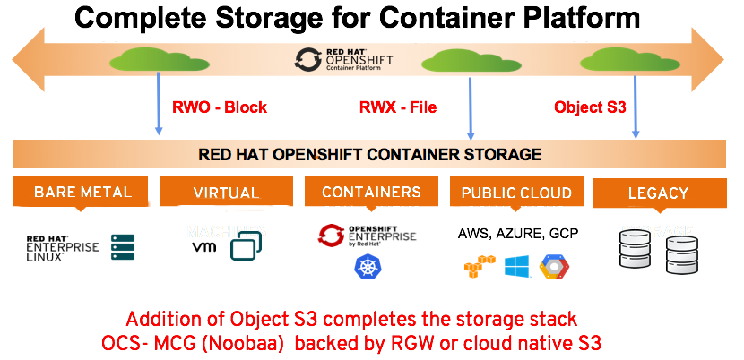
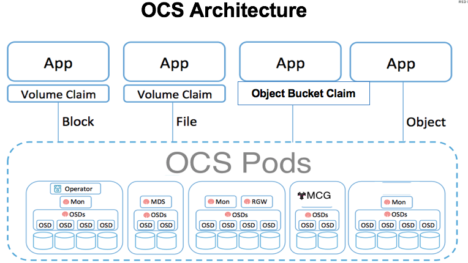
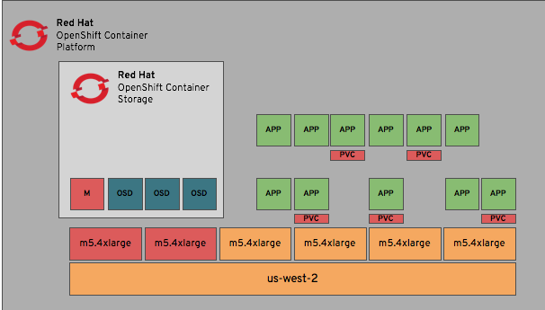
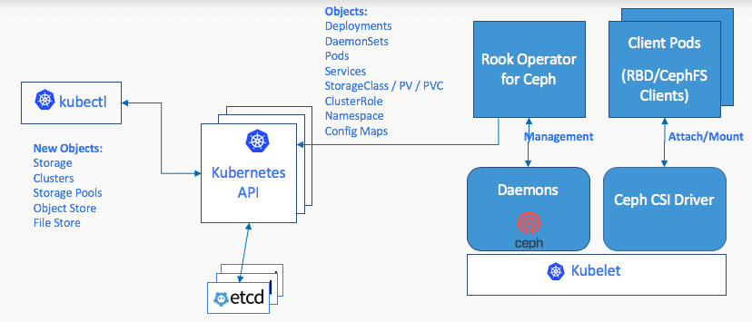
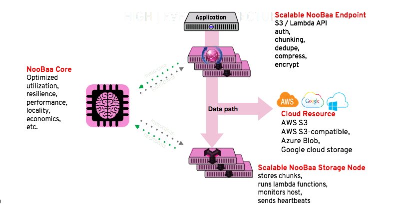

# Openshift Container Storage

## Intro

Red Hat Openshift Container Storage (OCS) es una solución de Software Defined Storage (SDS) ofrecida por Red Hat con base en productos Open Source como Ceph, Nooba y Rook y estandares como CSI (Container Storage Interfaces). OCS permite proveer almacenamiento persistente de tipo bloque, archivo y objeto. Facilita la operación, administración y provisión de recursos de storage multi-cloud.



## Arquitectura

Openshift Container Storage (OCS) en la version 4.2+ esta compuesto por una gran cantidad de proyectos OpenSources:

* Red Hat Ceph® Storage: Provee de almacenamiento de tipo archivo, bloque y objeto.
* Rook.io: Administra y orquesta el aprovisionamiento de persisten volumes y persisten volume claim (PV / PVC).
* Noobaa: Provee Object Storage.
    * Noobaa Multi-Cloud Gateway (MCG): Permite la federación de objectos a través de múltiples clouds (Technology Preview al día 2020/9/3)



### CePH

Ceph storage cluster es el corazón de OCS para bloque, archivos y objetos. Algunas de las características de la tecnología son:

* Componentes escalables.
* No single point of failure
* Solución basada por Software (no appliance)
* Open source
* Operable en hardware comodity

Ceph tiene tres tipos de demonios.

* OSD Almacena los datos de los clientes Ceph
* MON Mantiene una copia maestra del mapa del estado del cluster.
* MGR 
  * Mantiene un detalle de la información de los `placement groups`, la metadata de host y procesos.
  * Trabaja sobre tareas sobre el MON
  * Mejora el rendimienot y la escalabilidad



### Rook

Rook es el operador para Kubernetes que nos permite 

* Storage operator for Kubernetes
* Uses Kubernetes patterns (custom types and controllers)
* Automates deployment, bootstrapping, configuration, provisioning, scaling, upgrading, resource management
* Open source (Apache 2.0)
* Hosted by Cloud-Native Computing Foundation (CNCF)
* Framework for several storage providers



### Noobaa

* NooBaa core
* Manages data flow
* Provides object service
* NooBaa operator
* Deployment and second-day operations
* Command line interface
* Brings user experience to data management



## Ambiente

* Openshift 4.3+ en AWS o vSphere previamente desplegado.

## Requerimientos

### Software y suscripciones

* Red Hat Openshift Container Platform desplegado.
* Red Hat Openshift Contianer Storage.

[TBD] Para el modelo de suscripción

### Computo y storage

Los requerimientos iniciales para poder proveer la solución de Storage dependen en base a la necesidad de Storage a provisioar. Es clave que el sizing de la solución sea acorde desde el inicio, esto es porque NO SE PUEDE REDIMENSIONAR, como lo indica en la nota.

### Requerimientos minimos

* 3 nodos Openshift Container Storage donde cada nodo requere al menos un OSD y un MON.
  * 16 vCPU (4 core pairs)
  * 64GB memory
  * 2 TiB storage
    * 2 TiB storage por OSD (1 OSD por default, escalable a 3 OSDs por nodo)
  * 10 GB storage por MON (1 MON)
    * Los nodos siguientes no requieren espacio para MONs, un solo nodo MON tiene la base.
    * Recomendacion mínima en AWS: m5.4xlarge

Red Hat OpenShift Container Storage 4.2 soporta como minimo tres nodos y maximo nueve nodos. Cada nodo puede tener un maximo de tres 2 TiB OSDs. Con un mínimo de tres nodos cada uno con tres OSDs, 


### WARNING

OpenShift Container Storage 4.2 soporta un mínimo de tres nodos y un máximo de nuevos nodos. Cada nodo puede tener un maximo de tres 2TiB OSD con un mínimo de 3 nodos, cada uno con un OSD. La capacidad total de uso será 6TiB pero solo usable de 2 TiB. En caso de los máximos tendremos nueve nodos con un total 54 TiB y usables 18 TiB. Para asegurarse la alta disponibilidad hay que asegurarse  al menos tres réplicas en tres zonas de disponibilidad distinas. En caso de que se expanda el cluster, pasar de 3 a mas nodos, debemos hacerlo de 3 en 3. Por ejemplo de 3 nodos a 6 nodos. 

[Storage sizing and scaling for local devices](https://access.redhat.com/documentation/en-us/red_hat_openshift_container_storage/4.3/html-single/planning_your_deployment/index)

*WARNING: Asegurarse siempre de tener suficiente capacidad de almacenamiento*

*Si el almacenamiento es llenado por completo, no es posible agregar mas capacidad, eliminar o migrar el contenido fuera del almacenamiento para liberar.*

*Las alertas de capacidad se emiten cuando la capacidad de almacenamiento del cluster alcanza un 75% (casi lleno) y el 85% (lleno) de la capacidad total. Siempre abordar las alertas de capacidad con tiempo!!!. En caso de que el storage se llene completamente Contactar al Soporte de Red Hat*

## Operadores

Para poder instalar OCS vamos a desplegar tres operadores.

* Openshift Container Storage Operator
* Root Operator
* Noobaa Operator

### OpenShift Container Storage Operator

* Facilita que otros operadores realicen tareas administrativas.
* Configurar, desplegar y monitoreo OpenShift Container Storage operators
* Configurar sus CustomResources (CRs)

### Rook-Ceph Storage Operator

* Simple contenedor bootstrap y monitoreo del storage cluster.
* Cloud-native storage orchestrator para Ceph
  * Version comunitaria que soporta otras soluciones de storage: NFS, EdgeFS, etc.
* Rook y Ceph puede proveer:
  * Block devices
  * Share file system volumes
  * Object Storage.

Los pods que despliega

* Rook operator pod para Ceph
* Client pods para Ceph services
* Ceph daemons pod
* Ceph CSI driver pod

### MCG (NooBaa) Operator and Pods

MCG Operator crea, reconcilia el sistema de NooBaa y provee:

* Abstracción de almacenamiento de Objeto de S3
* Politica de data placement que habilitan el cloud híbrido y multi-cloud.
* Software-define para infraestructura.
* Agilidad.

El operador despliega.

* MCG core pod
* Management pod (UI/API)
* S3 pod (object-store)

## Instalación

### Provision de los nodos del cluster de OCS

Los nodos deben ser dedicados para el cluster, es muy importante que cumplan con los requesitos minimos para poder desplegar los operadores de 16vCPU, al menos 64GB RAM y 2TB por cada nodo

1. Obtenemos el ID del cluster.

```bash
CLUSTERID=$(oc get machineset -n openshift-machine-api -o jsonpath='{.items[0].metadata.labels.machine\.openshift\.io/cluster-api-cluster}')
echo $CLUSTERID
```

2. Aplicamos los nuevos nodos para OCS, los nodos seleccionados serán m5.4xlarge (16 CPU y 64GB RAM)

```bash
curl -s https://raw.githubusercontent.com/red-hat-storage/ocs-training/master/ocp4ocs4/cluster-workerocs-us-east-2.yaml | sed "s/CLUSTERID/$CLUSTERID/g" | oc apply -f -
```

3. Monitoreamos que los nodos queden creados

```bash
watch oc get machines -n openshift-machine-api
watch oc get machinesets -n openshift-machine-api
```

4. Verificamos que haya nuevos nodos workers

```bash
oc get nodes -l node-role.kubernetes.io/worker
oc get nodes -l cluster.ocs.openshift.io/openshift-storage=
```

### Instalacion del Operador

Para la instalación del operador deberemos crear el proyecto donde lo vamos a desplegar

1. Creamos el namespaces

```bash
oc create namespace openshift-storage
oc label namespace openshift-storage "openshift.io/cluster-monitoring=true"
```

2. Instalamos el Operador

    1. Para Instalar el operador vamos la consola de Openshift > OperatorHub > buscamos `container storage`.
    2. Suscribimos al operador y seleccionamos el channel 4.4 sobre el proyecto `openshift-storage`.
    3. Monitoreamos que el Cluster Service Version (cvs) se haya creado.

    ```bash
    watch oc -n openshift-storage get csv
    ```

3. Instalación de producto como instancia del Operador

    1. Nos vamos a la solapa `[Cluster Storage]` > `OCS Cluster Services`.
        Nota: en caso que la pagina nos avise que encuentra un error 404 hacer lo siguiente:
            Click `[Create OCSInitialization]` realizar la inicialización y luego volver a `[Cluster Storage]`.

    2. Seleccionar los nodos que cumplan con los requisitos mínimos.
        - Nodos que cumplan con los 16 CPU y los 64GB RAM.

    3. Monitorear que los pods se creen.

    ```bash
    oc -n openshift-storage get pods
    ```

    4. Monitear los endopoint de NooBaa

    ```bash
    oc -n openshift-storage get noobaa
    ```


4. Verificación del despliegue.

Para verificar el estado de salud del cluster de OCS usamos la tool de root para poder ejecutar los comandos de CePH.

1. Instalación del cliente.

```bash
curl -s https://raw.githubusercontent.com/rook/rook/release-1.1/cluster/examples/kubernetes/ceph/toolbox.yaml | sed 's/namespace: rook-ceph/namespace: openshift-storage/g'| oc apply -f -
```

2. Login en el pod

```bash
TOOLS_POD=$(oc get pods -n openshift-storage -l app=rook-ceph-tools -o name)
oc rsh -n openshift-storage $TOOLS_POD
```

3. Dentro del pod ejecutamos los siguientes comandos

```bash
ceph status
ceph osd status
ceph osd tree
ceph df
rados df
ceph versions
```

```bash
sh-4.2# ceph status
  cluster:
    id:     6dfc516d-1356-45b0-95a9-e6ca7b506a84
    health: HEALTH_OK

  services:
    mon: 3 daemons, quorum a,b,c (age 18h)
    mgr: a(active, since 18h)
    mds: ocs-storagecluster-cephfilesystem:1 {0=ocs-storagecluster-cephfilesystem-a=up:active} 1 up:standby-replay
    osd: 3 osds: 3 up (since 18h), 3 in (since 18h)

  task status:
    scrub status:
        mds.ocs-storagecluster-cephfilesystem-a: idle
        mds.ocs-storagecluster-cephfilesystem-b: idle

  data:
    pools:   3 pools, 96 pgs
    objects: 154 objects, 333 MiB
    usage:   3.8 GiB used, 6.0 TiB / 6.0 TiB avail
    pgs:     96 active+clean

  io:
    client:   1.2 KiB/s rd, 13 KiB/s wr, 2 op/s rd, 1 op/s wr

sh-4.2# ceph osd status
+----+--------------------------------------------+-------+-------+--------+---------+--------+---------+-----------+
| id |                    host                    |  used | avail | wr ops | wr data | rd ops | rd data |   state   |
+----+--------------------------------------------+-------+-------+--------+---------+--------+---------+-----------+
| 0  | ip-10-0-145-133.us-east-2.compute.internal | 1303M | 2046G |    0   |     0   |    0   |     0   | exists,up |
| 1  | ip-10-0-142-171.us-east-2.compute.internal | 1303M | 2046G |    0   |  3276   |    2   |   106   | exists,up |
| 2  | ip-10-0-170-108.us-east-2.compute.internal | 1303M | 2046G |    0   |     0   |    0   |     0   | exists,up |
+----+--------------------------------------------+-------+-------+--------+---------+--------+---------+-----------+
sh-4.2# ceph osd tree
eph versionsID  CLASS WEIGHT  TYPE NAME                                STATUS REWEIGHT PRI-AFF
 -1       6.00000 root default
 -5       6.00000     region us-east-2
-10       2.00000         zone us-east-2a
 -9       2.00000             host ocs-deviceset-1-0-dgszg
  1   ssd 2.00000                 osd.1                        up  1.00000 1.00000
 -4       2.00000         zone us-east-2b
 -3       2.00000             host ocs-deviceset-0-0-9t2qr
  0   ssd 2.00000                 osd.0                        up  1.00000 1.00000
-14       2.00000         zone us-east-2c
-13       2.00000             host ocs-deviceset-2-0-pzkml
  2   ssd 2.00000                 osd.2                        up  1.00000 1.00000
sh-4.2# ceph df
RAW STORAGE:
    CLASS     SIZE        AVAIL       USED        RAW USED     %RAW USED
    ssd       6.0 TiB     6.0 TiB     838 MiB      3.8 GiB          0.06
    TOTAL     6.0 TiB     6.0 TiB     838 MiB      3.8 GiB          0.06

POOLS:
    POOL                                           ID     STORED      OBJECTS     USED        %USED     MAX AVAIL
    ocs-storagecluster-cephblockpool                1     279 MiB         132     837 MiB      0.02       1.7 TiB
    ocs-storagecluster-cephfilesystem-metadata      2     2.2 KiB          22      96 KiB         0       1.7 TiB
    ocs-storagecluster-cephfilesystem-data0         3         0 B           0         0 B         0       1.7 TiB
sh-4.2# rados df
POOL_NAME                                     USED OBJECTS CLONES COPIES MISSING_ON_PRIMARY UNFOUND DEGRADED RD_OPS      RD WR_OPS      WR USED COMPR UNDER COMPR
ocs-storagecluster-cephblockpool           837 MiB     132      0    396                  0       0        0    110 1.3 MiB  62333 695 MiB        0 B         0 B
ocs-storagecluster-cephfilesystem-data0        0 B       0      0      0                  0       0        0      0     0 B      0     0 B        0 B         0 B
ocs-storagecluster-cephfilesystem-metadata  96 KiB      22      0     66                  0       0        0 130982  64 MiB     45  13 KiB        0 B         0 B

total_objects    154
total_used       3.8 GiB
total_avail      6.0 TiB
total_space      6.0 TiB
sh-4.2# ceph versions
{
    "mon": {
        "ceph version 14.2.8-81.el8cp (0336e23b7404496341b988c8057538b8185ca5ec) nautilus (stable)": 3
    },
    "mgr": {
        "ceph version 14.2.8-81.el8cp (0336e23b7404496341b988c8057538b8185ca5ec) nautilus (stable)": 1
    },
    "osd": {
        "ceph version 14.2.8-81.el8cp (0336e23b7404496341b988c8057538b8185ca5ec) nautilus (stable)": 3
    },
    "mds": {
        "ceph version 14.2.8-81.el8cp (0336e23b7404496341b988c8057538b8185ca5ec) nautilus (stable)": 2
    },
    "overall": {
        "ceph version 14.2.8-81.el8cp (0336e23b7404496341b988c8057538b8185ca5ec) nautilus (stable)": 9
    }
}
sh-4.2#
```

## Colectar información para Soporte

La herramienta `must-gather` es una herramienta util para poder colectar la información que tendremos que acercar a soporte de Red Hat para que puedan analizar el caso.

Si queremos extraer información del cluster sin OCS

```bash
oc adm must-gather
```

Para tener información mas detallada respecto al cluster de OCS

```bash
oc adm must-gather --image=quay.io/ocs-dev/ocs-must-gather
```


## Monitoreo

OCS es monitoreado desde Prometheus, podemos consultar sus estadisticas desde la consola web yendo a `Metrics` y en el TextBox ingresar las queries en PromQL.

```
rate(ceph_osd_op[5m])
irate(ceph_osd_op[5m])
sum(irate(process_cpu_seconds_total[5m]))
irate(process_cpu_seconds_total[5m])
```

## Configuracion de Storage Class por defecto

Una vez instalado el cluster de OCS vamos a cambiar el storage class por defecto, vamos a sacar el de `gp2` sobre `EBS` y seleccionar el interno de `OCS`. Para esto modificamos los labels.

    1. Eliminar Annotation: La opción mas facil es editarlo desde la consola web `Storage` > `Storage Class` > `gp2` eliminar el annotation `storageclass.kubernetes.io/
        is-default-class`

    2. Agregar Annotation: Agregar la misma annotation para el storageclass `ocs-storagecluster-ceph-rbd` editar `storageclass.kubernetes.io/
        is-default-class=true`.


## Crear volumenes Ceph RBD

Ahora vamos a provisionar un volumen para una aplicación con storage del tipo bloque creando un volumen Ceph RADOS Block Device (RBD) volume. Para esto utilizamos `ocs-storagecluster-ceph-rdb` como storageclass utilizado por Openshift para poder cerar un volumen `ReadWriteOnce` (RWO). 

```
oc new-project my-database-app
oc new-app rails-pgsql-persistent -p VOLUME_CAPACITY=5Gi
oc status
```

```bash
$ oc get pvc -n my-database-app
NAME         STATUS   VOLUME                                     CAPACITY   ACCESS MODES   STORAGECLASS                  AGE
postgresql   Bound    pvc-0cab8113-2e7f-47e9-92b1-7f411a9fca20   5Gi        RWO            ocs-storagecluster-ceph-rbd   12m
```

Una vez que la aplicación ha levantado podemos consultar la url y agregar el path /articles, nos logueamos con `openshift` y password `secret`. Todas las notas son almacenadas en al base de datos postgresql.

```
http://rails-pgsql-persistent-my-database-app.apps.cluster-deb5.deb5.sandbox456.opentlc.com/articles
```

## Examinar el Ceph Block Pool

Vamos a examinar el `ocs-storagecluster-cephblockpool` creado por `ocs-storagecluster-ceph-rdb`.

1. Login en el toolbox pod.

```bash
TOOLS_POD=$(oc get pods -n openshift-storage -l app=rook-ceph-tools -o name)
oc rsh -n openshift-storage $TOOLS_POD
```

2. Chequeamos el estado de ocupación

```
sh-4.2# ceph df   
RAW STORAGE:
    CLASS     SIZE        AVAIL       USED         RAW USED     %RAW USED
    ssd       6.0 TiB     6.0 TiB     1000 MiB      4.0 GiB          0.06
    TOTAL     6.0 TiB     6.0 TiB     1000 MiB      4.0 GiB          0.06

POOLS:
    POOL                                           ID     STORED      OBJECTS     USED        %USED     MAX AVAIL 
    ocs-storagecluster-cephblockpool                1     333 MiB         169     999 MiB      0.02       1.7 TiB 
    ocs-storagecluster-cephfilesystem-metadata      2     2.2 KiB          22      96 KiB         0       1.7 TiB
    ocs-storagecluster-cephfilesystem-data0         3         0 B           0         0 B         0       1.7 TiB
sh-4.2# rados df  
POOL_NAME                                     USED OBJECTS CLONES COPIES MISSING_ON_PRIMARY UNFOUND DEGRADED RD_OPS      RD WR_OPS      WR USED COMPR UNDER COMPR 
ocs-storagecluster-cephblockpool           999 MiB     169      0    507                  0       0        0    216 2.4 MiB  70348 822 MiB        0 B         0 B
ocs-storagecluster-cephfilesystem-data0        0 B       0      0      0                  0       0        0      0     0 B      0     0 B        0 B         0 B
ocs-storagecluster-cephfilesystem-metadata  96 KiB      22      0     66                  0       0        0 140536  69 MiB     45  13 KiB        0 B         0 B

total_objects    191
total_used       4.0 GiB
total_avail      6.0 TiB
total_space      6.0 TiB
sh-4.2# 
```

Podemos mirar el número de objetos se han creado.

```
sh-4.2# rbd -p ocs-storagecluster-cephblockpool ls
csi-vol-2b8edafd-ecaf-11ea-af57-0a580a810205
csi-vol-ab513347-ed51-11ea-af57-0a580a810205
```

### Mapear el PV con un RBD

Es util poder mapear un volumen Ceph RBD con un pv.

```bash
$ oc get pv -o 'custom-columns=NAME:.spec.claimRef.name,PVNAME:.metadata.name,STORAGECLASS:.spec.storageClassName,VOLUMEHANDLE:.spec.csi.volumeHandle'
NAME                      PVNAME                                     STORAGECLASS                  VOLUMEHANDLE
postgresql                pvc-0cab8113-2e7f-47e9-92b1-7f411a9fca20   ocs-storagecluster-ceph-rbd   0001-0011-openshift-storage-0000000000000001-ab513347-ed51-11ea-af57-0a580a810205
rook-ceph-mon-b           pvc-151fb1d8-b885-4ae9-97e6-e82a150f61ae   gp2                           <none>
ocs-deviceset-2-0-pzkml   pvc-35756587-335f-4cd3-8126-a3b815a31d7c   gp2                           <none>
ocs-deviceset-1-0-dgszg   pvc-5afa4519-07be-40b7-a393-5666705cb825   gp2                           <none>
rook-ceph-mon-a           pvc-5f1105fb-aa7b-437a-a307-1a641758c565   gp2                           <none>
terminal-hub-data         pvc-cd5622ab-636c-4968-937d-6ab21fb76a11   gp2                           <none>
db-noobaa-db-0            pvc-cf1248ad-b60f-43b1-a385-00deb0fefd64   ocs-storagecluster-ceph-rbd   0001-0011-openshift-storage-0000000000000001-2b8edafd-ecaf-11ea-af57-0a580a810205
rook-ceph-mon-c           pvc-d5afb8bd-3df5-47ad-b0ca-6e248563e983   gp2                           <none>
ocs-deviceset-0-0-9t2qr   pvc-f174ab0c-7fba-45c9-bd84-b0cf72ec23f6   gp2                           <none>
``` 

La segunda parte de la columna VOLUMEHANDLE mapea con el volumen rbd dentro de ceph

Determinar el nombre del RBD de el pvc asignado para PostgreSQL (PV)

```bash
$ oc get pv pvc-0cab8113-2e7f-47e9-92b1-7f411a9fca20 -o jsonpath='{.spec.csi.volumeHandle}' | cut -d '-' -f 6- | awk '{print "csi-vol-"$1}'
csi-vol-ab513347-ed51-11ea-af57-0a580a810205
```

```
sh-4.2# rbd -p ocs-storagecluster-cephblockpool ls
csi-vol-2b8edafd-ecaf-11ea-af57-0a580a810205
csi-vol-ab513347-ed51-11ea-af57-0a580a810205 >>> POSTGRES PV
```

Podemos revisarlos desde dentro del pod

```bash
$ TOOLS_POD=$(oc get pods -n openshift-storage -l app=rook-ceph-tools -o name)
$ oc rsh -n openshift-storage $TOOLS_POD rbd -p ocs-storagecluster-cephblockpool info csi-vol-ab513347-ed51-11ea-af57-0a580a810205
rbd image 'csi-vol-ab513347-ed51-11ea-af57-0a580a810205':
        size 5 GiB in 1280 objects
        order 22 (4 MiB objects)
        snapshot_count: 0
        id: ab9dad18abfd
        block_name_prefix: rbd_data.ab9dad18abfd
        format: 2
        features: layering
        op_features:
        flags:
        create_timestamp: Wed Sep  2 19:22:41 2020       
        access_timestamp: Wed Sep  2 19:22:41 2020       
        modify_timestamp: Wed Sep  2 19:22:41 2020       
```


## CephFS Volumes para crear Application Deployments

En este apartado veremos como crear volumenes CephFS bajo el pool `ocs-storagecluster-cephfilesystem-data0`. Esto permite que podamos provisionar storage bajo el storage class `ocs-storagecluster-cephfs` para crear volumenes con `ReadWriteMany (RWX)` como modo de escritura para los PVC.

### Deploy Registry Application

1. Deploy registry

```
curl -s https://raw.githubusercontent.com/rook/rook/master/cluster/examples/kubernetes/ceph/csi/cephfs/kube-registry.yaml | sed 's/storageClassName: rook-cephfs/storageClassName: ocs-storagecluster-cephfs/g'| oc apply -f -
```

2. Chequeo del deploy

```
oc get -n kube-system pvc
oc get -n kube-system deployment
oc get -n kube-system pods
```

3. Exploner deployment

```bash
oc expose -n kube-system deployment kube-registry
oc create route edge -n kube-system --service=kube-registry
oc get -n kube-system route
KUBE_REGISTRY_ROUTE=$(oc get -n kube-system route | awk '/kube-registry/ {print $2}')
```

4. Instalar podman

```
sudo yum -y install podman
sudo podman pull docker.io/library/alpine
sudo podman push docker.io/library/alpine --tls-verify=false $KUBE_REGISTRY_ROUTE/alpine
```

### Revisar el volumen CephFS Volume

Una vez que subimos información al volumen CephFS vamos a revisar donde estan ubicados los volumenes de la provison del punto anterior.

1. Abrimos una shell remota

```bash
TOOLS_POD=$(oc get pods -n openshift-storage -l app=rook-ceph-tools -o name)
oc rsh -n openshift-storage $TOOLS_POD
```

2. Creamos un directorio de trabajo

```
mkdir /tmp/registry
```

3. Detectamos el mon endpoint y el user secret para la conexión

```bash
mon_endpoints=$(grep mon_host /etc/ceph/ceph.conf | awk '{print $3}')
my_secret=$(grep key /etc/ceph/keyring | awk '{print $3}')
```

4. Montar el fs CephFS

```bash
mount -t ceph -o mds_namespace=ocs-storagecluster-cephfilesystem,name=admin,secret=$my_secret $mon_endpoints:/ /tmp/registry
df -h /tmp/registry
ls /tmp/registry/volumes/csi/csi-vol-*/*/docker/registry/v2/repositories/alpine/
_layers  _manifests  _uploads
```

## Multi-Cloud Object Gateway

Para poder ver el estado de MCG (Multi Cloud Object Gateway) debemos instalar el agente de NooBaa

```bash
curl -s https://api.github.com/repos/noobaa/noobaa-operator/releases/latest | grep "linux" | cut -d : -f 2,3 | tr -d \" | wget -qi - ; mv noobaa-linux-* noobaa ; chmod +x noobaa; sudo mv noobaa /usr/bin/
```

### Check MCG Status

```
oc project openshift-storage
noobaa status
```

En la salida vamos aver el health check de NooBaa y los endpoint disponibles.

```
$ noobaa status
INFO[0000] CLI version: 2.3.0
INFO[0000] noobaa-image: noobaa/noobaa-core:5.5.0
INFO[0000] operator-image: noobaa/noobaa-operator:2.3.0
INFO[0000] Namespace: openshift-storage
INFO[0000]
INFO[0000] CRD Status:

INFO[0000] ✅ Exists: CustomResourceDefinition "noobaas.noobaa.io" 
INFO[0000] ✅ Exists: CustomResourceDefinition "backingstores.noobaa.io" 
INFO[0000] ✅ Exists: CustomResourceDefinition "bucketclasses.noobaa.io"
INFO[0000] ✅ Exists: CustomResourceDefinition "objectbucketclaims.objectbucket.io"
INFO[0000] ✅ Exists: CustomResourceDefinition "objectbuckets.objectbucket.io"
INFO[0000]
INFO[0000] Operator Status:
INFO[0000] ✅ Exists: Namespace "openshift-storage"      
INFO[0000] ✅ Exists: ServiceAccount "noobaa"
INFO[0000] ✅ Exists: Role "ocs-operator.v4.4.2-bt8kz"   
INFO[0000] ✅ Exists: RoleBinding "ocs-operator.v4.4.2-bt8kz-noobaa-jc8h8"
INFO[0000] ✅ Exists: ClusterRole "ocs-operator.v4.4.2-nf77m" 
INFO[0000] ✅ Exists: ClusterRoleBinding "ocs-operator.v4.4.2-nf77m-noobaa-6z2hm"
INFO[0000] ✅ Exists: Deployment "noobaa-operator"
INFO[0000]
INFO[0000] System Status:
INFO[0000] ✅ Exists: NooBaa "noobaa"
INFO[0000] ✅ Exists: StatefulSet "noobaa-core"
INFO[0000] ✅ Exists: StatefulSet "noobaa-db"
INFO[0000] ✅ Exists: Service "noobaa-mgmt"
INFO[0000] ✅ Exists: Service "s3"
INFO[0000] ✅ Exists: Service "noobaa-db"
INFO[0000] ✅ Exists: Secret "noobaa-server"
INFO[0000] ✅ Exists: Secret "noobaa-operator"
INFO[0000] ✅ Exists: Secret "noobaa-endpoints"
INFO[0000] ✅ Exists: Secret "noobaa-admin"
INFO[0000] ✅ Exists: StorageClass "openshift-storage.noobaa.io"
INFO[0000] ✅ Exists: BucketClass "noobaa-default-bucket-class" 
INFO[0000] ✅ Exists: Deployment "noobaa-endpoint"
INFO[0000] ✅ Exists: HorizontalPodAutoscaler "noobaa-endpoint"
INFO[0000] ✅ (Optional) Exists: BackingStore "noobaa-default-backing-store" 
INFO[0000] ⬛ (Optional) Not Found: CredentialsRequest "noobaa-aws-cloud-creds" 
INFO[0000] ⬛ (Optional) Not Found: CredentialsRequest "noobaa-azure-cloud-creds"
INFO[0000] ⬛ (Optional) Not Found: Secret "noobaa-azure-container-creds"
INFO[0000] ✅ (Optional) Exists: PrometheusRule "noobaa-prometheus-rules" 
INFO[0000] ✅ (Optional) Exists: ServiceMonitor "noobaa-service-monitor" 
INFO[0000] ✅ (Optional) Exists: Route "noobaa-mgmt"     
INFO[0000] ✅ (Optional) Exists: Route "s3"
INFO[0000] ✅ Exists: PersistentVolumeClaim "db-noobaa-db-0" 
INFO[0000] ✅ System Phase is "Ready"
INFO[0000] ✅ Exists:  "noobaa-admin"

#------------------#
#- Mgmt Addresses -#
#------------------#

ExternalDNS : [https://noobaa-mgmt-openshift-storage.apps.cluster-deb5.deb5.sandbox456.opentlc.com https://a3e4d65b085ad4ab1883632387fb643c-679374814.us-east-2.elb.amazonaws.com:443]
ExternalIP  : []
NodePorts   : [https://10.0.131.113:31544]
InternalDNS : [https://noobaa-mgmt.openshift-storage.svc:443]
InternalIP  : [https://172.30.102.78:443]
PodPorts    : [https://10.131.0.4:8443]

#--------------------#
#- Mgmt Credentials -#
#--------------------#

email    : admin@noobaa.io
password : rICoK/j5BNA+ztWMu+Hy5w==

#----------------#
#- S3 Addresses -#
#----------------#

ExternalDNS : [https://s3-openshift-storage.apps.cluster-deb5.deb5.sandbox456.opentlc.com https://ad239ccb7a1294137b6724a9d71f8db1-878320353.us-east-2.elb.amazonaws.com:443]
ExternalIP  : []
NodePorts   : [https://10.0.151.74:31752]
InternalDNS : [https://s3.openshift-storage.svc:443]
InternalIP  : [https://172.30.60.147:443]
PodPorts    : [https://10.128.2.7:6443]

#------------------#
#- S3 Credentials -#
#------------------#

AWS_ACCESS_KEY_ID     : Fj0PXVl7zEcom5EumSb9
AWS_SECRET_ACCESS_KEY : pWcHbTMKGHypnjF6YSl10oUzWjvucJPoHTnFTMcn

#------------------#
#- Backing Stores -#
#------------------#

NAME                           TYPE     TARGET-BUCKET                                                    PHASE   AGE
noobaa-default-backing-store   aws-s3   nb.1599004747181.apps.cluster-deb5.deb5.sandbox456.opentlc.com   Ready   22h14m12s

#------------------#
#- Bucket Classes -#
#------------------#

NAME                          PLACEMENT                                                             PHASE   AGE
noobaa-default-bucket-class   {Tiers:[{Placement: BackingStores:[noobaa-default-backing-store]}]}   Ready   22h14m12s

#-----------------#
#- Bucket Claims -#
#-----------------#

No OBCs found
```

*En la salida podremos ver el endopoint s3 que puede ser usado para conectar a los bucket. Se puede usar de manera externa lo que incurre a costo de trafico o de manera interna que no incurre a costo alguno.*

### Creamos un Bucket Claim

Un Object Bucket Claim (OBC) puede ser usado como un request s3-compatible con el bucket backend. Cuando se usa el comando `noobaaa obc create`, se crean un ConfigMap y Secret que de manera conjunta continene toda la información que la aplicación necesita usar para el servicio de storage de objecto.

Creamos el OBC

```
noobaa obc create test21obc
```

```
$ noobaa obc create test21obc
INFO[0000] ✅ Exists: StorageClass "openshift-storage.noobaa.io" 
INFO[0000] ✅ Created: ObjectBucketClaim "test21obc"     
INFO[0000]
INFO[0000] NOTE:
INFO[0000]   - This command has finished applying changes to the cluster.
INFO[0000]   - From now on, it only loops and reads the status, to monitor the operator work.
INFO[0000]   - You may Ctrl-C at any time to stop the loop and watch it manually.
INFO[0000]
INFO[0000] OBC Wait Ready:
INFO[0000] ⏳ OBC "test21obc" Phase is ""
INFO[0003] ✅ OBC "test21obc" Phase is Bound
INFO[0003]
INFO[0003]
INFO[0003] ✅ Exists: ObjectBucketClaim "test21obc"      
INFO[0003] ✅ Exists: ObjectBucket "obc-openshift-storage-test21obc"
INFO[0003] ✅ Exists: ConfigMap "test21obc"
INFO[0003] ✅ Exists: Secret "test21obc"
INFO[0003] ✅ Exists: StorageClass "openshift-storage.noobaa.io"
INFO[0003] ✅ Exists: BucketClass "noobaa-default-bucket-class" 
INFO[0003] ✅ Exists: NooBaa "noobaa"
INFO[0003] ✅ Exists: Service "noobaa-mgmt"
INFO[0003] ✅ Exists: Secret "noobaa-operator"
INFO[0003] ✅ Exists: Secret "noobaa-admin"
INFO[0003] ✈️  RPC: bucket.read_bucket() Request: {Name:test21obc-0769ae45-4dea-445a-8b18-8d3daff06fd6}
WARN[0003] RPC: GetConnection creating connection to wss://localhost:41913/rpc/ 0xc00007ecd0
INFO[0003] RPC: Connecting websocket (0xc00007ecd0) &{RPC:0xc0004ee960 Address:wss://localhost:41913/rpc/ State:init WS:<nil> PendingRequests:map[] NextRequestID:0 Lock:{state:1 sema:0} ReconnectDelay:0s}
INFO[0003] RPC: Connected websocket (0xc00007ecd0) &{RPC:0xc0004ee960 Address:wss://localhost:41913/rpc/ State:init WS:<nil> PendingRequests:map[] NextRequestID:0 Lock:{state:1 sema:0} ReconnectDelay:0s}
INFO[0003] ✅ RPC: bucket.read_bucket() Response OK: took 4.4ms

ObjectBucketClaim info:
  Phase                  : Bound
  ObjectBucketClaim      : kubectl get -n openshift-storage objectbucketclaim test21obc
  ConfigMap              : kubectl get -n openshift-storage configmap test21obc
  Secret                 : kubectl get -n openshift-storage secret test21obc
  ObjectBucket           : kubectl get objectbucket obc-openshift-storage-test21obc
  StorageClass           : kubectl get storageclass openshift-storage.noobaa.io
  BucketClass            : kubectl get -n openshift-storage bucketclass noobaa-default-bucket-class

Connection info:
  BUCKET_PORT            : 443
  BUCKET_HOST            : s3.openshift-storage.svc
  BUCKET_NAME            : test21obc-0769ae45-4dea-445a-8b18-8d3daff06fd6
  AWS_ACCESS_KEY_ID      : QmUGQeNE2HE7xrzcKxJQ
  AWS_SECRET_ACCESS_KEY  : 6MdLIs6nndbCzUmOrUMcdl6pFrXf64n0YX9wgD9/

Shell commands:
  AWS S3 Alias           : alias s3='AWS_ACCESS_KEY_ID=QmUGQeNE2HE7xrzcKxJQ AWS_SECRET_ACCESS_KEY=6MdLIs6nndbCzUmOrUMcdl6pFrXf64n0YX9wgD9/ aws s3 --no-verify-ssl --endpoint-url https://10.0.151.74:31752'

Bucket status:
  Name                   : test21obc-0769ae45-4dea-445a-8b18-8d3daff06fd6
  Type                   : REGULAR
  Mode                   : OPTIMAL
  ResiliencyStatus       : OPTIMAL
  QuotaStatus            : QUOTA_NOT_SET
  Num Objects            : 0
  Data Size              : 0.000 B
  Data Size Reduced      : 0.000 B
  Data Space Avail       : 1.000 PB
```


Una vez creado vemos el objecto obc en openshift

```
$ oc get obc
NAME        STORAGE-CLASS                 PHASE   AGE  
test21obc   openshift-storage.noobaa.io   Bound   3m37s
```

Si queremos ver el secret

```bash
$ oc get -n openshift-storage secret test21obc -o yaml
apiVersion: v1
data:
  AWS_ACCESS_KEY_ID: UW1VR1FlTkUySEU3eHJ6Y0t4SlE=
  AWS_SECRET_ACCESS_KEY: Nk1kTElzNm5uZGJDelVtT3JVTWNkbDZwRnJYZjY0bjBZWDl3Z0Q5Lw==
kind: Secret
metadata:
  creationTimestamp: "2020-09-02T22:29:48Z"
  finalizers:
  - objectbucket.io/finalizer
  labels:
    app: noobaa
    bucket-provisioner: openshift-storage.noobaa.io-obc
    noobaa-domain: openshift-storage.noobaa.io
  name: test21obc
  namespace: openshift-storage
  ownerReferences:
  - apiVersion: objectbucket.io/v1alpha1
    blockOwnerDeletion: true
    controller: true
    kind: ObjectBucketClaim
    name: test21obc
    uid: 14b4464c-e30a-40eb-ac09-da0b55c43228
  resourceVersion: "445053"
  selfLink: /api/v1/namespaces/openshift-storage/secrets/test21obc
  uid: 93b0d901-d4b4-4b94-a1f0-ad1ea085ad84
type: Opaque
```


y el `ConfigMaps`

```
$ oc get -n openshift-storage cm test21obc -o yaml
apiVersion: v1
data:
  BUCKET_HOST: s3.openshift-storage.svc
  BUCKET_NAME: test21obc-0769ae45-4dea-445a-8b18-8d3daff06fd6
  BUCKET_PORT: "443"
  BUCKET_REGION: ""
  BUCKET_SUBREGION: ""
kind: ConfigMap
metadata:
  creationTimestamp: "2020-09-02T22:29:48Z"
  finalizers:
  - objectbucket.io/finalizer
  labels:
    app: noobaa
    bucket-provisioner: openshift-storage.noobaa.io-obc
    noobaa-domain: openshift-storage.noobaa.io
  name: test21obc
  namespace: openshift-storage
  ownerReferences:
  - apiVersion: objectbucket.io/v1alpha1
    blockOwnerDeletion: true
    controller: true
    kind: ObjectBucketClaim
    name: test21obc
    uid: 14b4464c-e30a-40eb-ac09-da0b55c43228
  resourceVersion: "445054"
  selfLink: /api/v1/namespaces/openshift-storage/configmaps/test21obc
  uid: 6c5dd25d-9f7a-49fa-9317-136171dbea32
```

### Examinamos el objecto `obc` previamente creado.

Vamos a crear una aplicación para poder testear el bucket

```
apiVersion: objectbucket.io/v1alpha1
kind: ObjectBucketClaim
metadata:
  name: obc-test
spec:
  generateBucketName: "obc-test-noobaa"
  storageClassName: openshift-storage.noobaa.io
---
apiVersion: batch/v1
kind: Job
metadata:
  name: obc-test
  labels:
    app: obc-test
spec:
  template:
    metadata:
      labels:
        app: obc-test
    spec:
      restartPolicy: OnFailure
      containers:
        - image: mesosphere/aws-cli:latest
          command: ["sh"]
          args:
            - '-c'
            - 'set -x && s3cmd --no-check-certificate --host $BUCKET_HOST:$BUCKET_PORT --host-bucket $BUCKET_HOST:$BUCKET_PORT du'
          name: obc-test
          env:
            - name: BUCKET_NAME
              valueFrom:
                configMapKeyRef:
                  name: obc-test
                  key: BUCKET_NAME
            - name: BUCKET_HOST
              valueFrom:
                configMapKeyRef:
                  name: obc-test
                  key: BUCKET_HOST
            - name: BUCKET_PORT
              valueFrom:
                configMapKeyRef:
                  name: obc-test
                  key: BUCKET_PORT
            - name: AWS_DEFAULT_REGION
              valueFrom:
                configMapKeyRef:
                  name: obc-test
                  key: BUCKET_REGION
            - name: AWS_ACCESS_KEY_ID
              valueFrom:
                secretKeyRef:
                  name: obc-test
                  key: AWS_ACCESS_KEY_ID
            - name: AWS_SECRET_ACCESS_KEY
              valueFrom:
                secretKeyRef:
                  name: obc-test
                  key: AWS_SECRET_ACCESS_KEY
```

Desplegamos el OBC y una aplicación

```
curl -s https://raw.githubusercontent.com/red-hat-storage/ocs-training/master/ocp4ocs4/obc_app_example.yaml | oc apply -f -
oc get pod -n obc-test -l app=obc-test
```

Verificamos la conexión una vez que haya corrido el Job

```
$ kubectl logs -n obc-test -l app=obc-test
+ s3cmd --no-check-certificate --signature-v2 --host s3.openshift-storage.svc:443 --host-bucket s3.openshift-storage.svc:443 du
0        0 objects s3://obc-test-noobaa-046d3eeb-aaf1-47ae-bad2-ee3a4c5c6cc1/
--------
0        Total
```

## Agregar capacidad al cluster

Para incrementar capacidad de storage a OCS debemos agregar mas storage workers nodes o agregar mas capacidad de storage a los nodos existenes.

### Agregar Storage Workers

Par agregar mas nodos, es posible agregar mas MachineSets o escalar los Openshift Storage Container MachineSets. Para este laboratorio vamos a aumentar los workers y escapar las intancias en cantidad.

1. Check de los MachineSets creados

```
oc get machinesets -n openshift-machine-api
```

2. Escalar los workerocs machineSets.

```
oc get machinesets -n openshift-machine-api -o name | grep workerocs | xargs -n1 -t oc scale -n openshift-machine-api --replicas=2
```

3. Monitorear el crecimiento de los machineSets y esperar que terminen

```
watch oc get machinesets -n openshift-machine-api
```

4. Luego de que los nuevos workers esten disponibles, visualizamos los labels.

```
oc get nodes -l cluster.ocs.openshift.io/openshift-storage=
```

5. Una vez agreagado los nodos debemos ir a la consola web y agregar la capacidad de deseada, en este caso vamos a ir a `Installed Operators` > `Operator Details` > `Storage Cluster` y click en los tres puntos sobre el marguen derecho en la misma linea que la instalacia `ocs-storagecluster`. Una vez hecho click seleccionar `Add Capacity`. 

En la ventana de `Add Capacty` tenemos que agregar la cantidad de Storage que debe ser par y esta capacidad agregada internamente se multiplicará por 3 en la cantidad de storage dedicado en la solucion.

6. Monitorear la creación de los nuevos pods de OSD

Una vez lanzada la extensión en el dashboard de `OCS PV` vamos a ver que el `Status` estará en AMARILLO hasta que vuelva a ponerse en VERDE. Una vez que veamos que esta trabajando el estacio total pasará de 6TBi a 12TiB, si habiamos iniciado con 6TiB originalmente esto es 3 nodos con 2TBi cada uno.

```
watch oc get pods -n openshift-storage -o wide
```

7. Verificamos el nuevo storage

```
TOOLS_POD=$(oc get pods -n openshift-storage -l app=rook-ceph-tools -o name)
$ oc rsh -n openshift-storage $TOOLS_POD
sh-4.2# ceph status
  cluster:
    id:     6dfc516d-1356-45b0-95a9-e6ca7b506a84
    health: HEALTH_OK

  services:
    mon: 5 daemons, quorum a,b,c,d,e (age 43m)
    mgr: a(active, since 23h)
    mds: ocs-storagecluster-cephfilesystem:1 {0=ocs-storagecluster-cephfilesystem-a=up:active} 1 up:standby-replay
    osd: 6 osds: 6 up (since 8m), 6 in (since 8m)   >>>>> INCREMENTA a 6 OSDs

  task status:
    scrub status:
        mds.ocs-storagecluster-cephfilesystem-a: idle
        mds.ocs-storagecluster-cephfilesystem-b: idle

  data:
    pools:   3 pools, 288 pgs
    objects: 208 objects, 420 MiB
    usage:   7.1 GiB used, 12 TiB / 12 TiB avail    >>>>> INCREMENTA a 12TiB
    pgs:     288 active+clean

  io:
    client:   1.2 KiB/s rd, 25 KiB/s wr, 2 op/s rd, 2 op/s wr

sh-4.2# 
sh-4.2# ceph osd crush tree
ID  CLASS WEIGHT   TYPE NAME
 -1       12.00000 root default
 -5       12.00000     region us-east-2
-10        4.00000         zone us-east-2a
 -9        2.00000             host ocs-deviceset-1-0-dgszg
  1   ssd  2.00000                 osd.1
-21        2.00000             host ocs-deviceset-1-1-5ssll
  5   ssd  2.00000                 osd.5
 -4        4.00000         zone us-east-2b
 -3        2.00000             host ocs-deviceset-0-0-9t2qr
  0   ssd  2.00000                 osd.0
-19        2.00000             host ocs-deviceset-0-1-l4wts
  4   ssd  2.00000                 osd.4
-14        4.00000         zone us-east-2c
-13        2.00000             host ocs-deviceset-2-0-pzkml
  2   ssd  2.00000                 osd.2
-17        2.00000             host ocs-deviceset-2-1-tpsc8
  3   ssd  2.00000                 osd.3
sh-4.2# 
```

* Hay nuevos nodos adicionales uno en cada zona.
* En caso de escalado horizontal, los datos existentes en los viejos nodos de OSD son equilibrados con los nuevos nodos OSD para poder equilibrar la carga.

## Conclusiones

Teniendo en cuenta que OCS es una solución competa de storage es necesario tener en cuenta que los recurso de computo como de storage son elevados y hay que costearlos correctamente. Como solución de storage completa es una excelente opción por la facilidad de uso. 

Los pasos a seguir de este docuemento serán:

* Verificamos en profundidad de escenarios crítidos.
* Pruebas de alta disponibilidad y resiliencia.
* Pruebas de escalabilidad y reducción.
* Replicación de volumenes sobre otras soluciones.

## Links

* [Red Hat Openshift Container Storage](https://access.redhat.com/documentation/en-us/red_hat_openshift_container_storage/4.4/)
* [Ceph Block Device](https://docs.ceph.com/docs/master/rbd/)