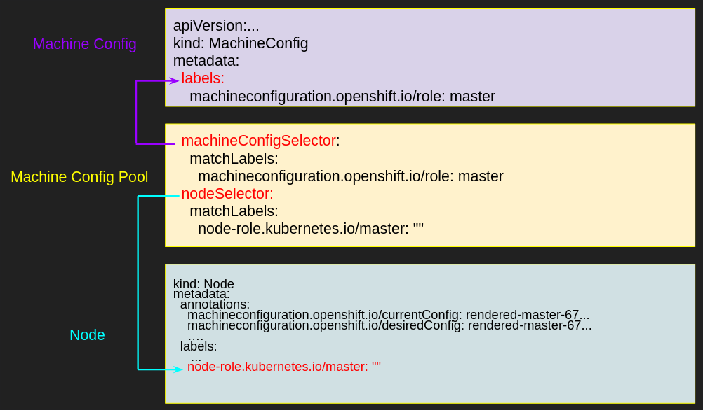
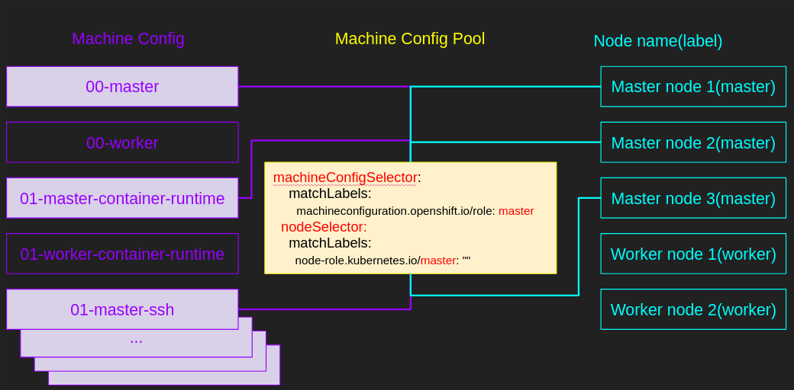

# MachineConfigPools

Con RHOCP3 era usal trabajar con tres grupos de nodos, nodos master, nodos worker y nodos de infraestructura. Los nodos de infraestructura tienen como fin solamente alojar servicios que son complementarios al funcionamiento del cluster como por ejemplo pod router, cluster logging, cluster metrics, integrated registry. 

Con RHOCP4 estos nodos siguen estando pero inicialmente luego del proceso de instalación no estan presentes en nuestra lista, aunque los servicios complementarios que no son de aplicación siguen alojados en nuestros nodos workers. 

Cómo podemos convertir un nodo worker en nodo de infraestructura?. En una primera instancia lo identificamos a través de una etiqueta o label.

```shell
oc label node $NODE node-role.kubernetes.io/infra=
```

Al aplicarlo vamos a ver que en le listado de nodos los nodos de infraestructura pueden ser identificados pero si hacemos un upgrade del cluster, los nodos quedan por fuera y no son actualizados. Este comportamiento es esperado.

## Operadores en Openshift 4

Como sabemos Openshift 4 está formado por un conjunto de operadores, en pocas palabras todo es administrador por un Operador. El sistema operativo, los updates y los cambios de configuración del los nodos RHCOS son administrado por el Machine Config Operator. Entender este operador es clave para poder administrar los nodos masters y workers correctamente al nuevo paradigma de administrador en Openshift 4.

## Machine Config Operator?

MCO es un operador como cualquier otro pero a nivel cluster y es especialmente uno de la infraestructura de Openshift. Este administra el sistema operativo y mantiene el cluster actualizado en configuración. A través de MCO, los administradores de la plataforma pueden configurar y actualizar los servicios systemd, cri-o/kubelet, kernel, NetworkManger, etc sobre cada uno de los nodos. Para poder hacerlo MCO crea archivos MachineConfig que representan la configuración estatica de cada uno de los nodos. Luego aplica la configuración a cada nodo.

## Subcomponentes de Machine Config Operator.

El MCO es un completo componente. Este posee varios subcomponentes y cada subcomponente realizar una tarea puntual diferente. Examinemos los subcomponentes.

+ Machine Config Server
+ machine Config Controller
- Template Controller
- Update Controller
- Render Controller
- Kubelet Config Controller
+ Machine Config Daemon

## ¿Qué hace Machine Config Controller?

Machine config Controller comienza a ser utilizado una vez es instalado el cluster. Los objetivos del MCC son:

+ Cordinar upgrades de máquinas con la configuración definida en el objeto MachineConfig.
+ Provee opciones para controlar el upgrade por set de maquinas individuales.

En pocas palabras este controlador genera Machine Config para los roles pre-definidos (master y workers) y monitorea si son modificados los MachineConfig CR (custom resource) existentes y si son creados nuevos MachineConfig. Cuando el controlador detecta cualquiera de los dos eventos, genera un nuevo objeto MachineConfig que contiene todas las configuraciones de maquinas basadas en MachineConfigSelector y cada MachineConfigPool.

La descripción de los demas componentes:

Template Controller

+ Genera el MachineConfig predefinido para workers y master.
+ Observa conrtollerConfig para generar MachineConfig propios

Reder Controller

+ Observa objetos MachineConfigPool para buscar todos los MachineConfig.
+ Update de los CurrentMachineConfig con los MachineConfig presentados.
+ Detecta cambios en los MachineConfig y sincroniza todos los MachineConfigPool con el nuevo CurrentMachineConfig.

Update Controller

+ Observa si un MachineConfigPool.Status.CurrentMachineConfig es actualizado.
+ Actualiza maquinas con el MachineConfig deseado y coordina con el demonio que está ejecutando en cada maquina.

## MachineConfig

Habíamos mensionado el objeto MachineConfig, pero que es?. Es el fuente de la configuración de las máquinas y es usado para la instalación y el primer booteo, como tambien para los upgrades. El MachineConfig debe ser estatico. Ej. Este no debe contener links o path remotos para generar configuración dinámica. En pocas palabras define la configuración de las maquinas que usan RHCOS. Inicialmente usa un formato ignition, de manera que es posible administrar el storage, systemd, kernel, etc.

## MachineConfigPools

El MachineConfigPool es el objeto principal. El MachineConfigPool opera de manera similar como un RoleBinding donde son asociados roles y usuarios. Un MachineConfigPool asocia _nodes_ con _MachineConfig_.

El MachineConfigPool mapea entre nodos y MachineConfig. El MachineConfigPool tiene dos selectores y cada selector matchea MachienConfig con nodos.



El Render Controller en el MachineConfigController monitorea los MachineConfigPool y genera objetos estaticos MachineConfig llamados rendered-master-xxxx y rendered-worker-xxxx. Estos objetos pueden incluir multiples MachineConfig. El Render Controller tambien chequea que los nodos en el pool puedan aplicar la ultima configuración de máquina rendered-xxxx. Si el MachineConfigPool cambia entonces el render controller créa un nuevo rendered-xxx y es aplicado.




## Infra worker nodes

Ahora definiremos los nodos worker como nodos de infra. Originalmente tenemos dos roles worker y master. Los pasos para definirlos son los que siguen.

1. Crear un MachineConfigPool

```bash
cat << EOF > infra-machineconfigpool.yaml
apiVersion: machineconfiguration.openshift.io/v1
kind: MachineConfigPool
metadata:
  name: infra
spec:
  machineConfigSelector:
    matchExpressions:
      - {key: machineconfiguration.openshift.io/role, operator: In, values: [worker,infra]}
  nodeSelector:
    matchLabels:
      node-role.kubernetes.io/infra: ""
  paused: false
EOF
```

En la definición se puede ver el matchExpression hace referencia a nodos de worker e infra, esto es porque los MachineConfig seran lso mismos para los dos, pero si se desea configurar MachineConfig personalizados para solo los de infra, deberemos cambiar el label a solo infra.

2. Crear la definición solo para infra.

```bash
cat << EOF > infra-machineconfigpool.yaml
apiVersion: machineconfiguration.openshift.io/v1
kind: MachineConfig
metadata:
  labels:
    machineconfiguration.openshift.io/role: infra
  name: 50-infra
spec:
  config:
    ignition:
      version: 2.2.0
    storage:
      files:
      - contents:
          source: data:,test
        filesystem: root
        mode: 0644
        path: /etc/testinfra
EOF
```

3. Actualizar la etiqueta de los nodos.

```bash
oc label node <node> node-role.kubernetes.io/worker-
oc label node <node> node-role.kubernetes.io/infra=
```

## Ingresar a los nodos desde el demonio de MachineConfigDeamon

```
oc get pods -n openshift-machine-config-operator -l k8s-app=machine-config-daemon --field-selector "spec.nodeName=worker0.ocp4.labs.semperti.local"
NAME                          READY   STATUS    RESTARTS   AGE
machine-config-daemon-jxvrw   2/2     Running   0          4h9m
```

```
oc rsh -n openshift-machine-config-operator machine-config-daemon-jxvrw chroot /rootfs cat /etc/customtest
custom
```

## Documentación y problemas

### Links para entender el funcionamiento de los MachineConfigPools y MachineConfig

* [OpenShift Container Platform 4: How does Machine Config Pool work?](https://www.redhat.com/en/blog/openshift-container-platform-4-how-does-machine-config-pool-work)

### Como crear MachineConfigPools Customs, por ejemplo para los Infra nodes.

* [Custom pools](https://github.com/openshift/machine-config-operator/tree/master/docs)
* [Custom Machine Config Pool in OpenShift 4](https://access.redhat.com/solutions/5688941)

### Primeros problemas con MachineConfigPools (y no los últimos)

* [Node in degraded state because of the use of a deleted machineconfig: machineconfig.machineconfiguration.openshift.io; rendered-$[custom-machine-config] not found.](https://access.redhat.com/solutions/4970731)

    Esto pasa cuando un MachineConfig es eliminado, el MachineConfigController no reconoce un rollback a un render-xxxx previo, esto hace que el MachineConfigPool quede en `Degradated`. La solución setear a mano los render-xxxx MachineConfig existente en los annotations de los nodos, esto lo hacemos editando el nodo.

* [MachineConfigPool stuck in degraded after applying a modification in OpenShift Container Platform 4.x](https://access.redhat.com/solutions/5244121)

    Esto puede pasar cuando los archivos creados dentro de un `MachineConfig` no son seteados dentro del nodo RHCOS.
    
* [How to control Node updates in Red Hat OpenShift Container Platform 4](https://access.redhat.com/solutions/4669561)
    
    Con esta nota controlamos el numero de nodos que vamos a actualizar en cada modificación/agregado de los MC.

* [Managing SSH Keys with the MCD](https://github.com/openshift/machine-config-operator/blob/master/docs/Update-SSHKeys.md)

* [How to force validation of failing / stuck MachineConfigurations in Red Hat OpenShift Container Platform 4.x?](https://access.redhat.com/solutions/5414371)